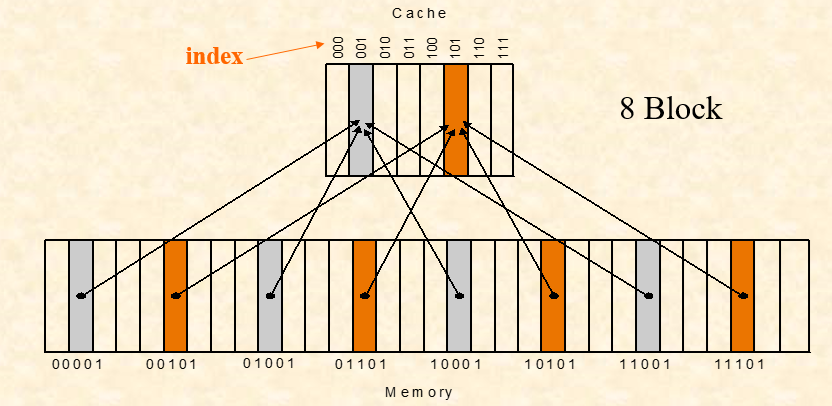
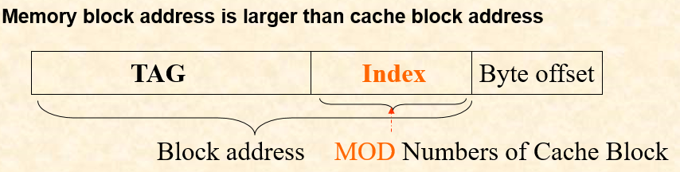
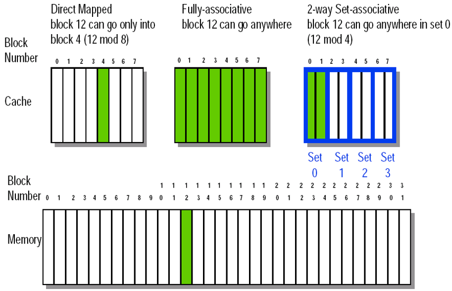
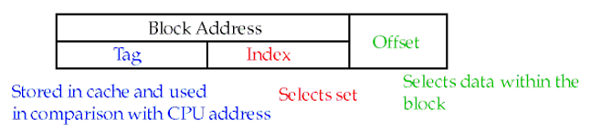
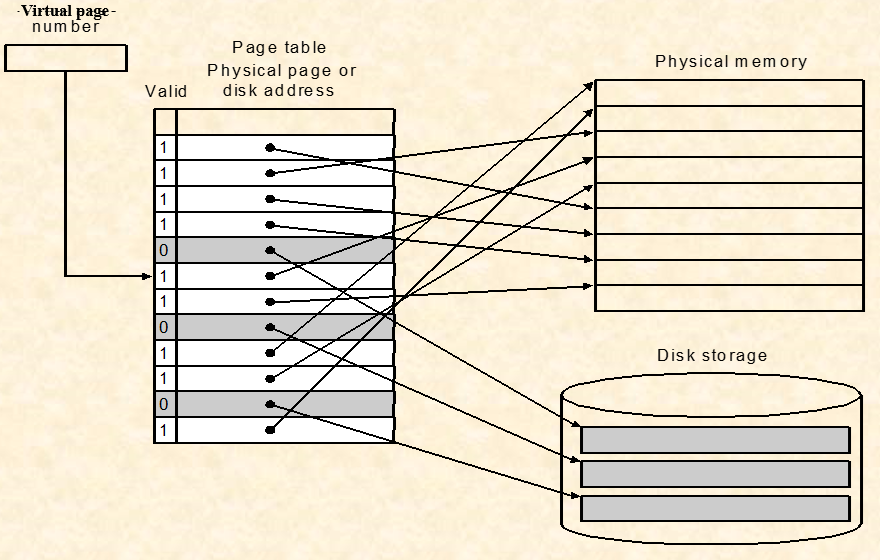
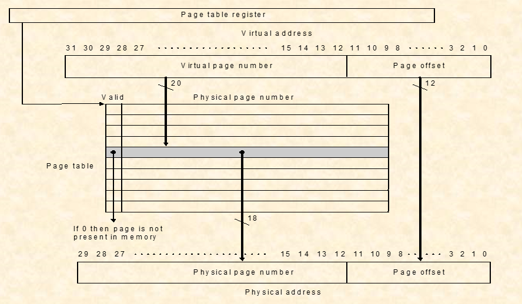
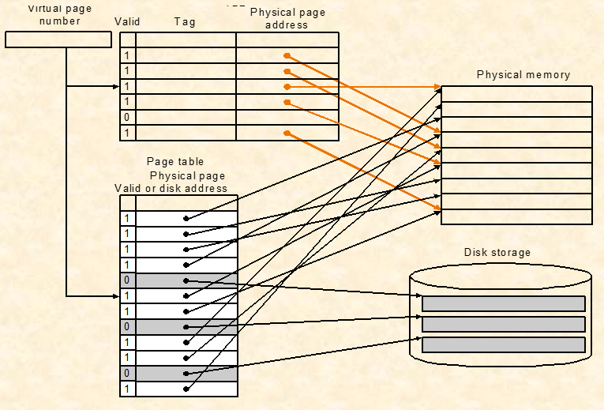
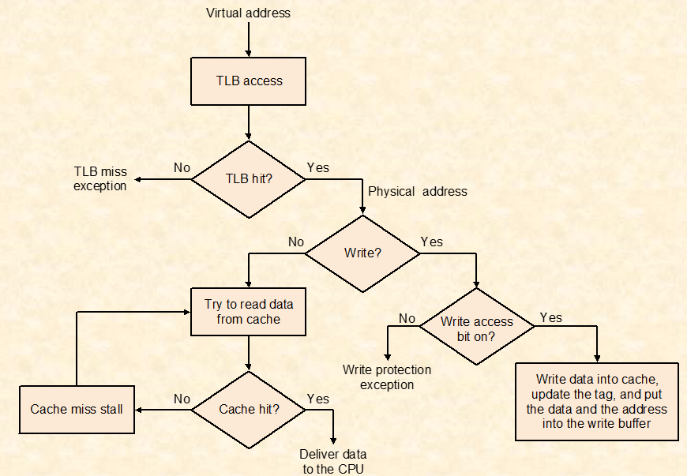

# organization

## Chapter 7  **Large and Fast: Exploiting Memory Hierarchy** 

### *Memories review*

- **ROM **(Read-Only Memory):单独的一块内部存储器，和RAM同用来存储和保存永久数据。
  1. 数据不能随意更新。
  2. 任何时候都可以读取。
  3. 断电也能保存数据。
- **PROM** (Programmable Read-Only Memory):可编程只读存储器，也叫One-Time Programmable (OTP)ROM，可以用程序操作的**只读内存**。
  1. 只允许数据写入**一次**。
  2. 如果烧入错误只能报废。

- **EROM **(Eraseable Read Only Memory)：可擦除唯读记忆体。

- **RAM** (Random Access Memory):随机存储记忆体，相当于PC机上的移动存储，用来存储和保存数据。
  1. 任何时候都可以**读写**。
  2. 通常作为操作系统或其他正在运行程序的临时存储介质(可称作系统内存)。

- **SRAM **(Static Random-Access Memory):静态随机存取存储器。
  1. 数据被存储在一对非门中。
  2. 速度非常快可是比DRAM需要花更多的空间。

- **DRAM** (Dynamic Random Access Memory):动态随机存取存储器。
  1. DRAM速度慢，价格便宜。
  2. SRAM速度快，价格昂贵。
  3. 磁盘的平均访问时间很长。

**为什么引进cache：用户想要更大更快的内存！**

### *Locality (局部性)*

1. **temporal locality** (locality in time)
   - 如果一个item被用到了，那么它很快就会再次被调用。
   - eg. **for**循环中的循环变量 **i**。

2. **spatial locality** (locality in space)
   - 如果一个item被用到了，那么它附近地址的item也很快会被调用。
   - eg. A[1]用完用A[2]。

3. **Our initial focus**：two levels (**upper,lower**)
   - **block:** minimum unit of data for transfer (传输用的最小单位).
   - **hit:** data requested is in the **upper** level (cache找到了).
   - **miss:** data requested is **not** in the upper level (cache没找到).
   - **hit time:** The time to access the **upper** level of the memory hierarchy, which **includes** the time needed to determine whether the access is a hit or a miss. (访问cache的时间，包括判断访问是否命中所需的时间).
   - **miss penalty: **The time to **replace a block** in the upper level with the corresponding block from the lower level, plus the time to **deliver this block to the processor**(用下层memory去替换上层blcok的时间+将该block传给processor的时间)

利用 **时间局部性** 和 **空间局部性** 来做cache。

### *Exploiting Memory Hierarchy (利用内存层次结构)* 

- **Hierarchies** bases on memories of different **speeds** and **size**
  - The more closely CPU the level is,the **faster** the one is.
  - The more closely CPU the level is,the **smaller** the one is.
  - The more closely CPU the level is,the more  **expensive**.

- **Speed**: registers > L1-Cache (On-Chip) > L2-Cache (SRAM) > Main Memory(DRAM)> Disk,Tape;

- **Size**: registers < L1-Cache (On-Chip) < L2-Cache (SRAM) < Main Memory(DRAM)< Disk,Tape;

### *Handling Cache Reads hit and Misses (解决cache读的命中和错失)*

- **Read hits**: 这是我们想要的。
- **Read misses**: 
  - Instruction cache miss
  - data cache miss

- **main steps taken on instruction cache miss**
  - Stall the CPU
  - Fetch block from memory
  - Deliver to cache
  - Restart CPU read

### *Handling Cache Writes hit and Misses (解决cache写的命中和错失)*

- #### **Write hits:**

  - **write-black **(写回): 
    - Write the data into **only** the data cache.
    - Write back data from the cache to memory later.(只在数据被替换出cache时，被修改（用dirty标记）的cache数据才会被写到下级memory)
    - Fast.
    - Cache control bit: **both valid and dirty bits**
    - Causing Inconsistent(导致了下级memory和cache不一致的现象).
    - **Advantage:** Writes occur at speed of cache and main memory bandwidth is smaller when multiple writes occur to the same block. 
    - **Disadvantage：**一旦更新后的数据未被写入存储时出现系统掉电的情况，数据将无法找回。
  - **write-through **(写直达):
    - Write the data into **both** the memory the cache
    - Write always update both cache and the memory.
    - Cache control bit: **only a valid bit**
    - Ensuring Consistent(确保了下级memory和cache的一致性.
    - **Advantage:** Read misses don't result in writes, memory hierarchy is consistent and it is simple to implement.
    - **Disadvantage：**Slower------write buffer(速度慢但是操作简单).

- #### **Write miss:**

  - **write allocate**: 在cache中分配一个空间，将memory的数据读入cache，再对cache进行write操作，并将block标记为**dirty**。注意：对于**Write-back**模式，如果分配的这个位置原数据是**dirty**的，需要将该数据先写回下一级memory。
  - **write around** (no write allocate): 将要写的内容直接写回下层memory。

- #### Write stall:

  - When the CPU must wait for writes to complete during write through.

- #### **Write buffers:**

  - A small cache that can hold a few values waiting to go to main memory. 
  - To avoid stalling on writes, many CPUs use a write buffer.
  - This buffer helps when writes are clustered.
  - It does not entirely eliminate stalls since it is possible for the buffer to fill if the burst is larger than the buffer. 

### Block Placement

- **Direct mapped**
- **Fully associative**
- **Set associative**

### *Direct Mapped Cache (直接映射)*

- Block address **MOD** Numbers of Cache Block

- Mapping an address to Multiword Cache Block
  - eg.Consider a cache with 64 blocks and a block size of 16 bytes.
  - What block number does byte address 1200 map to?
  - **Answer:**
  - **Block address**：**floor**[Byte address/Bytes per block] = **floor**[1200/16]=75
  - Block address **MOD** number of cache blocks = 75 **MOD** 64 = 11

### *Fully associative (全局映射)*

- 

- In a direct-mapped cache, there is only one block that can be replaced.
- In set-associative and fully-associative caches, there are N blocks (where N is the degree of associativeity)

### *The Format of the Physical Address*

- Every block has an **address tag** that stores the main memory address of
  the data stored in the block.
- When checking the cache, the processor will ***compare*** the
  **requested memory address** to the **cache tag** -- if the two are equal, then
  there is a cache hit and the data is present in the cache.

- Often, each cache block also has a **valid bit** that tells if the contents of the cache block are valid.

- The **index** field selects:

  - In case of a set-associative cache: **set**.

  - In case of a direct-mapped cache: **block**.

  - bits for set-associative cache: **log2(sets).**
  - bits for direct-mapped cache: **log2(blocks) .**

- The **Byte Offset** field selects：
  - The byte within the block.
  - bits：**log2 (size of block).**

- The Tag is used to find the matching block within a set or in the cache
  - bits: **Address_size**  -  **Index_size**  -  **Byte_Offset_Size**.

### *Strategy of block Replacement*

- **Random** - **randomly pick any block**
  - Easy to implement in hardware, just requires a random number generator
  - Spreads allocation uniformly across cache
  - May evict(驱逐) a block that is about to be accessed.

- **Least- recently used**(LRU) - **pick the block in the set which was least recently accessed**
  - Assumed more recently accessed blocks more likely to be referenced again
  - This requires extra bits in the cache to keep track of accesses.

- **First in,First out**(FIFO) - Choose a block from the set which was first came into the cache

### *Larger blocks exploit spatial locality*

Taking advantage of spatial locality to lower miss rates with many word in the block.

### *Performance of different memory organization*

------

- **1  clock cycles to send the address**

-  **15** **memory bus clock cycles for each DRAM  access initiated**

-  **1 bus clock cycles to send a word of data**

-  **Block size is 4 words**

-  **Every word is 4 bytes** 

------

* **basic memory organization**
  - The time to transfer one word is 1+15+1=17
  - The miss penalty(The time to transfer one block is): 1+4*(1+15)=65 CLKs
  - Bandwidth: 4*4 / 65 ≈ 1/4(bytes per second) 

- **Wider Main memory**

  - With a main memory width of 2 words(**64bits**)
    - The miss penalty: 1+2*(15+1) = 33 CLKs
    - Bandwidth: 4*4 / 33 ≈ 0.48

  - With a main memory width of 4 words(**128bits**)
    - The miss penalty: 1+1*(15+1) = 17 CLks
    - Bandwidth: 4*4 / 17 ≈ 0.98

  - With 4 banks Interleaved Memory(并行的)
    - The miss penalty: 1+15+(4*1) = 20 CLKs
    - Bandwidth: 4*4 / 20 = 0.8

### *Performance in different block size*

- Increasing the block size tends to decrease miss rate
- Use **split caches** because there is more **spatial locality** in code

### *Measuring and improving cache performance*

- questions
  1. How to measure cache performance?
  2. How to improve performance?

- contents
  1. Measuring cache performance
  2. **Reducing cache misses** by more flexible placement of blocks
  3. **Reducing the miss penalty** using multilevel caches

- Average Memory Assess time 

  = hit time + miss time

  =hit rate * Cache time + miss rate * memory time														

1. #### Measuring cache performance

   - We use **CPU time** to measure cache performance.

     - **CPU time** 

       = I * CPI * Clock cycletime

       = (CPU execution clock cycles + Memory-stall clock cycles) * Clock cycle time

     - **Memory-stall clock cycles**

       = # of instructions * miss ratio * miss penalty

       = Read-stall cycles + Write- stall cycles

     - **Read-stall cycles**

       = Read / Program * Read miss rate * Read miss penalty

     - **Write-stall cycles**

       = Write / Program * Write miss rate * Write miss penalty + Write buffer stalls

   - If the write buffer stalls are small, we can safely ignore them.

   - If the cache block size is one word, the write miss penalty is 0.

   - In most write-through cache organizations, the read and write miss penalties are the same---the time to fetch the block from memory.

   - If write buffer stalls can be ignored,

     **Memory-stall clock cycles**

     = Memory accesses / Program * miss rate * miss penalty  

     = Instructions / Program * Misses / Instructions * Miss penalty

2. #### Reducing cache misses by flexible placement of blocks

   - **The disadvantage of a direct-mapped cache**

     - If the CPU requires the following memory units sequentially: word  0,word 8 and word 0. Word  0 and  word 8 both are mapped to cache block 0, so the third access will be a miss. 
     - But obviously, if one memory block can be placed in any cache block , the miss can be avoided. So, there is possibility that the miss rate can be improved.

   - **The basics of a set-associative cache**

     - A set-associative cache is divided into some sets. A set contains several blocks.
     - The memory block can be placed in any block in the corresponding set.
     - Set number(Index) = (Memory block number) **MOD**(Number of sets in the cache)

   -  **Miss rate versus set-associative**

     - Fully associative cache ‘s miss rate is the lowest.

   - **Locating a block in the set-associative cache**

     - The implementation of a four-way set-associative cache requires four comparators and a 4-to-1 multiplexor.

   - **Size of tags versus set associative**

     - Asume
       - Cache size is 4K Block
       - Block size is 4 words
       - Physical address is 32 bits

     - Question
       
     - Find the total number of set and total number of tag bits for variety associativity
       
     - Answer

       - Offset(Byte) = 16 = 2^4  **4 bits for address**
       - Number of memory block = 2^32 / 2^4 = 2^28   **28 bits for Block address**
       - Number of cache block = 4K = 2^12  **12 bits for Block address**

       

     - **For direct-mapped**
       - Bits of index = 12 bits
       - Bits of Tag = (28-12) * 4K = 16 * 4K = 64 Kbits
     - For two-way associative
       - Number of cache set = 2^12 / 2 = 2^11
       - Bits of index = 12-1 = 11 bits
       - Bits of Tag = (28-11) *2 *2K = 68 Kibts

     - For four-way associative
       - Number of cache set = 2^12 / 4 = 2^10
       - Bits of index = 12-2 =10 bits
       - Bits of Tag = (28-10) *2 *2K =72 Kibts

     - For full associative
       - Number of cache set = 2^12 / 2 ^12= 2^0
       - Bits of index = 12-12 =0 bits
       - Bits of Tag = (28-0) *2 *2K = 112 Kibts

   - **Choosing which block to replace**

     - The most commonly used scheme is **least recently used** (LRU). In an **LRU** scheme, the block replaced is the one that has been unused for the longest time.
     - As associativity increases, implementing **LRU** gets harder.

3. #### Reducing the miss penalty using multilevel caches

   - Add a second level cache:
     - Often primary cache is on the same chip as the processor 
     - Use SRAMs to add another cache above primary memory(DRAM)
     - Miss penalty goes down if data is in 2nd level cache.

### *Virtual Memory*

- **Main memory can act as a cache for the secondary storage (disk)**
- **Advantages:** 
  - Illusion of having more physical memory.
  - Program relocation
  - Protection

#### Pages: virtual memory blocks

- **Page faults**: the data is not in memory, retrieve it from disk.
  - Huge miss penalty, thus pages should be **fairly large.**
  - Reducing page faults is important (**LRU** is worth the price)
  - Can handle the faults in **software** instead of hardware
  - Using write-through is too expensive so we use **write back**.

- **Page Tables:** 

- Virtual memory systems use **fully associative** mapping method

#### **Making Address Translation Fast-----TLB**

- A cache for address translations: **T**ranslation **L**ook aside **B**uffer.

- TLB and cache

