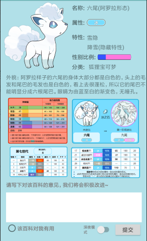
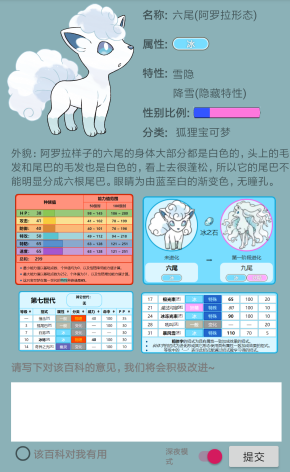
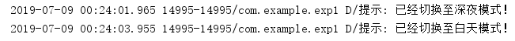

# 浙大android课程 Chapter-1

作者：林家丰

## 实验要求

- 创建一个Android app工程，包含一个activity
- 使用5种以上的View并实现一些简单交互
  - ImageView, Button, TextView,RadioButton, CheckBox, EditText, ProgressBar, SeekBar, Switch 等等不限
- 将一些交互结果输出log
- 打包生成apk

## 实验目的

- 对Android Studio的使用有初步的理解
- 对一些控件进行熟悉，方便之后开发出精美的APP

## 实验结果



如图所示，我制作了一个小百科。其中包含了ImageView, Button, TextView,RadioButton, EditText和Switch6个控件。点击**深夜模式**会切换到**深夜模式**，如下图所示



并且，在log中会输出语句



## 核心代码

- **界面代码**

```xml
<?xml version="1.0" encoding="utf-8"?>
<RelativeLayout
    android:id="@+id/rel"
    xmlns:android="http://schemas.android.com/apk/res/android"
    xmlns:tools="http://schemas.android.com/tools"
    xmlns:app="http://schemas.android.com/apk/res-auto"
    android:layout_width="match_parent"
    android:layout_height="match_parent"
    android:background="#b1e0e8"
    tools:context=".MainActivity">

    <TextView
        android:id="@+id/t1"
        android:layout_width="wrap_content"
        android:layout_height="wrap_content"
        android:layout_marginStart="7dp"
        android:layout_marginLeft="202dp"
        android:layout_marginTop="10dp"
        android:layout_toEndOf="@+id/i7"
        android:text="名称:"
        android:textSize="15dp"
        android:textStyle="bold" />

    <TextView
        android:id="@+id/t2"
        android:layout_width="wrap_content"
        android:layout_height="wrap_content"
        android:layout_marginStart="6dp"
        android:layout_marginLeft="250dp"
        android:layout_marginTop="10dp"
        android:layout_toEndOf="@+id/t1"
        android:fontFamily=""
        android:text="六尾(阿罗拉形态)"
        android:textSize="15dp" />

    <TextView
        android:id="@+id/t3"
        android:layout_width="wrap_content"
        android:layout_height="wrap_content"
        android:layout_below="@+id/t1"
        android:layout_marginStart="7dp"
        android:layout_marginLeft="202dp"
        android:layout_marginTop="19dp"
        android:layout_toEndOf="@+id/i7"
        android:fontFamily=""
        android:text="属性:"
        android:textSize="15dp"
        android:textStyle="bold" />

    <ImageView
        android:id="@+id/i1"
        android:layout_width="50dp"
        android:layout_height="50dp"
        android:layout_below="@+id/t2"
        android:layout_marginStart="6dp"
        android:layout_marginLeft="250dp"
        android:layout_marginTop="4dp"
        android:layout_toEndOf="@+id/t3"
        android:src="@drawable/ice" />

    <TextView
        android:id="@+id/t4"
        android:layout_width="wrap_content"
        android:layout_height="wrap_content"
        android:layout_below="@+id/t3"
        android:layout_marginStart="7dp"
        android:layout_marginLeft="202dp"
        android:layout_marginTop="19dp"
        android:layout_toEndOf="@+id/i7"
        android:text="特性:"
        android:textSize="15dp"
        android:textStyle="bold" />

    <TextView
        android:id="@+id/t5"
        android:layout_width="wrap_content"
        android:layout_height="wrap_content"
        android:layout_marginStart="6dp"
        android:layout_marginLeft="250dp"
        android:layout_marginTop="90dp"
        android:layout_toEndOf="@+id/t4"
        android:fontFamily=""
        android:text="雪隐"
        android:textSize="15dp" />

    <TextView
        android:id="@+id/t6"
        android:layout_width="wrap_content"
        android:layout_height="wrap_content"
        android:layout_below="@+id/t5"
        android:layout_marginStart="48dp"
        android:layout_marginLeft="250dp"
        android:layout_marginTop="5dp"
        android:layout_toEndOf="@+id/i7"
        android:fontFamily=""
        android:text="降雪(隐藏特性)"
        android:textSize="15dp" />

    <TextView
        android:id="@+id/t7"
        android:layout_width="wrap_content"
        android:layout_height="wrap_content"
        android:layout_below="@+id/t6"
        android:layout_marginStart="7dp"
        android:layout_marginLeft="202dp"
        android:layout_marginTop="6dp"
        android:layout_toEndOf="@+id/i7"
        android:text="性别比例:"
        android:textSize="15dp"
        android:textStyle="bold" />

    <ImageView
        android:id="@+id/i2"
        android:layout_width="90dp"
        android:layout_height="20dp"
        android:layout_below="@+id/t6"
        android:layout_marginStart="5dp"
        android:layout_marginLeft="285dp"
        android:layout_marginTop="6dp"
        android:layout_toEndOf="@+id/t7"
        android:src="@drawable/sex" />


    <TextView
        android:id="@+id/t8"
        android:layout_width="wrap_content"
        android:layout_height="wrap_content"
        android:layout_below="@+id/t7"
        android:layout_marginStart="7dp"
        android:layout_marginLeft="202dp"
        android:layout_marginTop="6dp"
        android:layout_toEndOf="@+id/i7"
        android:text="分类:"
        android:textSize="15dp"
        android:textStyle="bold" />

    <TextView
        android:id="@+id/t9"
        android:layout_width="wrap_content"
        android:layout_height="wrap_content"
        android:layout_below="@+id/i2"
        android:layout_marginStart="11dp"
        android:layout_marginLeft="250dp"
        android:layout_marginTop="6dp"
        android:layout_toEndOf="@+id/t8"
        android:text="狐狸宝可梦"
        android:textSize="15dp" />

    <TextView
        android:id="@+id/t11"
        android:layout_width="wrap_content"
        android:layout_height="wrap_content"
        android:layout_below="@+id/t8"
        android:layout_marginLeft="15dp"
        android:layout_marginTop="8dp"
        android:layout_marginBottom="274dp"
        android:text="外貌：阿罗拉样子的六尾的身体大部分都是白色的，头上的毛发和尾巴的毛发也是白色的，看上去很蓬松，所以它的尾巴不能明显分成六根尾巴。眼睛为由蓝至白的渐变色，无瞳孔。" />

    <ImageView
        android:id="@+id/i3"
        android:layout_width="180dp"
        android:layout_height="123dp"
        android:layout_below="@+id/t11"
        android:layout_alignTop="@+id/t11"
        android:layout_marginLeft="10dp"
        android:layout_marginTop="65dp"
        android:src="@drawable/ration" />

    <ImageView
        android:id="@+id/i4"
        android:layout_width="180dp"
        android:layout_height="130dp"
        android:layout_marginStart="2dp"
        android:layout_marginLeft="197dp"
        android:layout_marginTop="260dp"
        android:layout_toEndOf="@+id/i3"
        android:src="@drawable/evaluation" />

    <ImageView
        android:id="@+id/i5"
        android:layout_width="155dp"
        android:layout_height="100dp"
        android:layout_below="@+id/i3"
        android:layout_marginLeft="25dp"
        android:layout_marginTop="-1dp"
        android:src="@drawable/skill1" />

    <ImageView
        android:id="@+id/i6"
        android:layout_width="185dp"
        android:layout_height="100dp"
        android:layout_below="@+id/i4"
        android:layout_marginStart="10dp"
        android:layout_marginLeft="197dp"
        android:layout_marginTop="-4dp"
        android:layout_toEndOf="@+id/i5"
        android:src="@drawable/skill2" />

    <Switch
        android:id="@+id/nightswitch"
        android:layout_width="80dp"
        android:layout_height="40dp"
        android:layout_below="@+id/e1"
        android:layout_marginStart="79dp"
        android:layout_marginLeft="215dp"
        android:layout_marginTop="0dp"
        android:layout_toEndOf="@+id/t13"
        android:text="深夜模式"
        android:textColor="#7c7c7c"
        android:textSize="10dp"
        android:textStyle="bold" />

    <TextView
        android:id="@+id/t12"
        android:layout_width="365dp"
        android:layout_height="wrap_content"
        android:layout_below="@+id/i6"
        android:layout_marginLeft="15dp"
        android:layout_marginTop="0dp"
        android:text="请写下对该百科的意见，我们将会积极改进~"
        android:textColor="#7c7c7c"
        android:textStyle="bold" />

    <EditText
        android:id="@+id/e1"
        android:layout_width="365dp"
        android:layout_height="80dp"
        android:layout_below="@+id/t12"
        android:layout_marginLeft="15dp"
        android:layout_marginTop="11dp"
        android:background="#ffffff"
        android:textAlignment="textStart" />

    <TextView
        android:id="@+id/t13"
        android:layout_width="wrap_content"
        android:layout_height="wrap_content"
        android:layout_below="@+id/e1"
        android:layout_marginLeft="45dp"
        android:layout_marginTop="7dp"
        android:text="该百科对我有用"
        android:textColor="#7c7c7c"
        android:textStyle="bold" />

    <RadioButton
        android:id="@+id/ra1"
        android:layout_width="wrap_content"
        android:layout_height="wrap_content"
        android:layout_below="@+id/e1"
        android:layout_marginLeft="15dp"
        android:layout_marginTop="0dp" />

    <Button
        android:id="@+id/okbtn"
        android:layout_width="75dp"
        android:layout_height="40dp"
        android:layout_below="@+id/e1"
        android:layout_marginLeft="305dp"
        android:layout_marginTop="0dp"
        android:text="提交"
        android:textSize="15dp"/>

    <ImageView
        android:id="@+id/i7"
        android:layout_width="180dp"
        android:layout_height="180dp"
        android:layout_marginLeft="5dp"
        android:layout_marginTop="5dp"
        android:src="@drawable/vulpix_alola" />


</RelativeLayout>
```

- **交互代码：**

```java
package com.example.exp1;

import androidx.appcompat.app.AppCompatActivity;

import android.graphics.Color;
import android.os.Bundle;
import android.util.Log;
import android.view.View;
import android.widget.Button;
import android.widget.CompoundButton;
import android.widget.RelativeLayout;
import android.widget.Switch;
import android.widget.Toast;

public class MainActivity extends AppCompatActivity {
    private Button btn01;
    private Switch sw01;
    private RelativeLayout r01;
    @Override
    protected void onCreate(Bundle savedInstanceState) {
        super.onCreate(savedInstanceState);
        setContentView(R.layout.activity_main);
        btn01 = findViewById(R.id.okbtn);
        sw01 = findViewById(R.id.nightswitch);
        r01 = findViewById(R.id.rel);
        btn01.setOnClickListener(new View.OnClickListener() {
            @Override
            public void onClick(View view) {
                Toast.makeText(MainActivity.this,"您的反馈已提交~",Toast.LENGTH_SHORT).show();
            }
        });
        sw01.setOnCheckedChangeListener(new CompoundButton.OnCheckedChangeListener() {
            @Override
            public void onCheckedChanged(CompoundButton compoundButton, boolean b) {
                if(b)
                {
                    r01.setBackgroundColor(Color.rgb(139,177,183));
                    Log.d("提示","已经切换至深夜模式！");
                }
                else{
                    r01.setBackgroundColor(Color.rgb(177,224,232));
                    Log.d("提示","已经切换至白天模式！");
                }
            }
        });

    }
}

```

